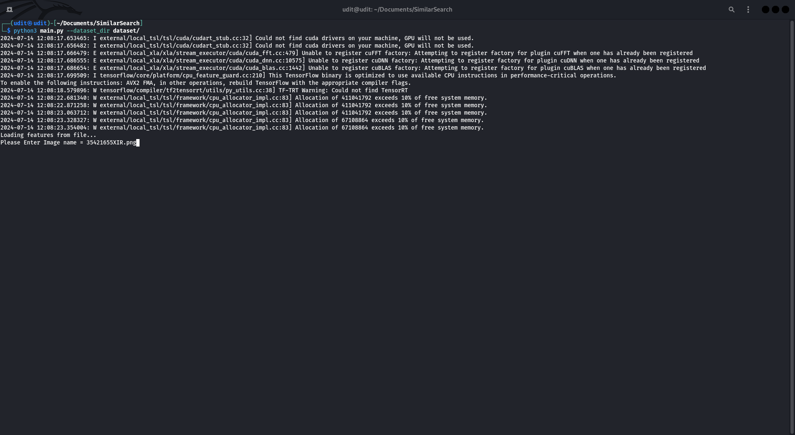
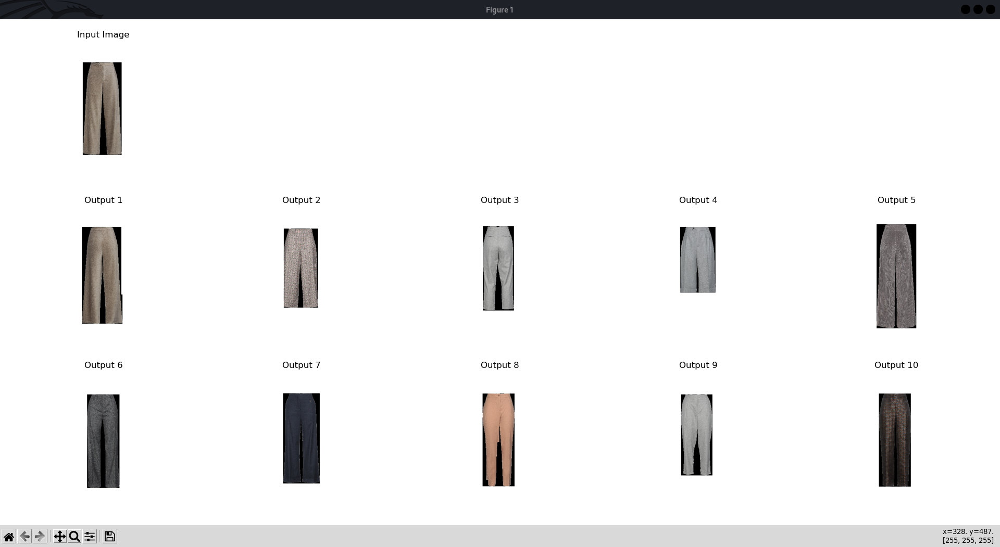
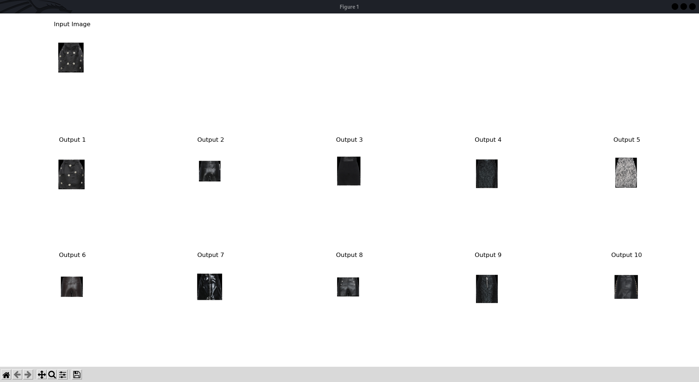

# SimilarSearch

SimilarSearch is a tool for finding similar items in a dataset. This project aims to provide an efficient and scalable solution for similarity search using various algorithms and techniques.

## Features

- Efficient similarity search
- Support for multiple similarity metrics
- Scalable for large datasets
- Easy to integrate and use
- 
## Testing Environment configurations--
-- OS - Linux
-- Python - 3.10
-- CPU = Intel i5 8th Gen, GPU = No

## Installation

To install the package, you can clone this repository and install the dependencies using `pip`.

```sh
git clone https://github.com/Udit0495/SimilarSearch.git
cd SimilarSearch
pip install -r requirements.txt
```
## Uses
after installing run main.py using command
```sh
python3 main.py --dataset_dir "path"
```



## There are some ouputs --





