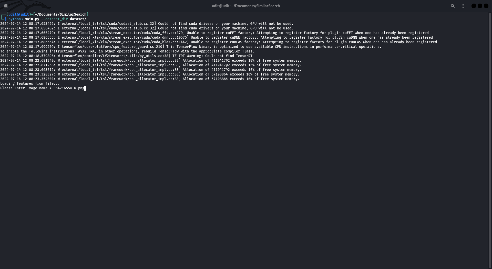
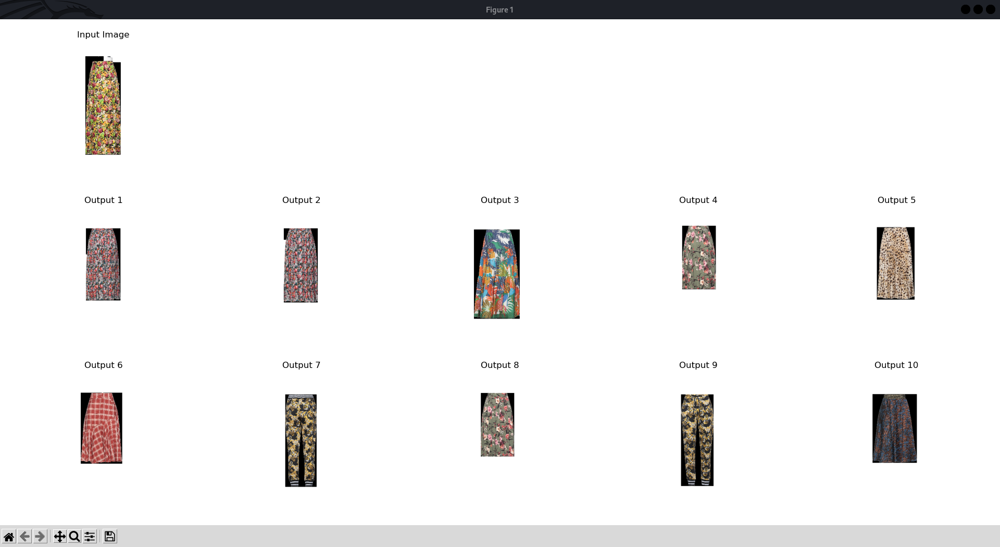
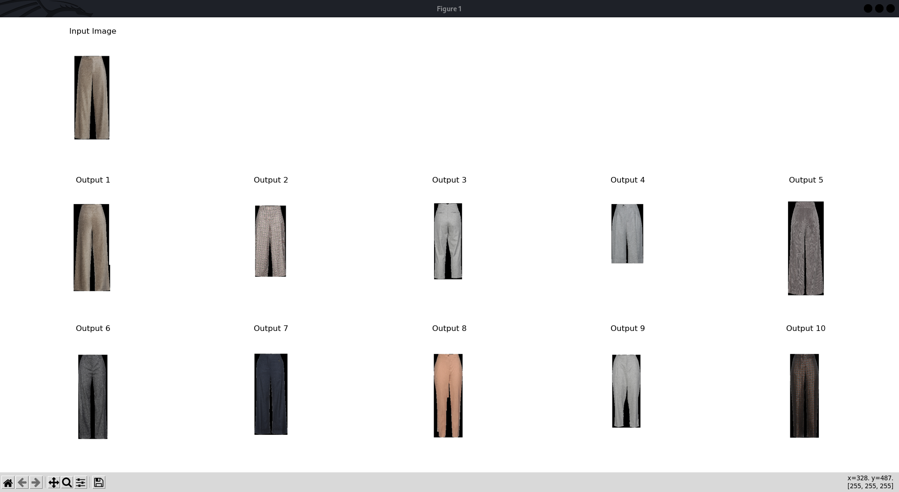
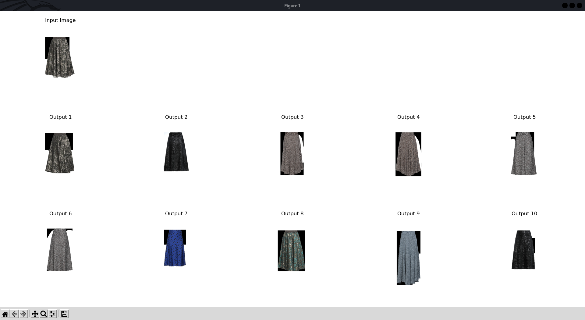
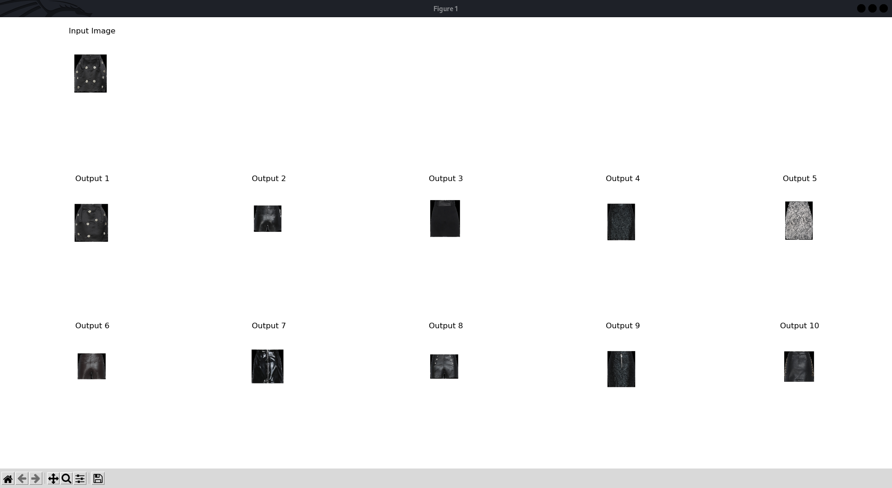
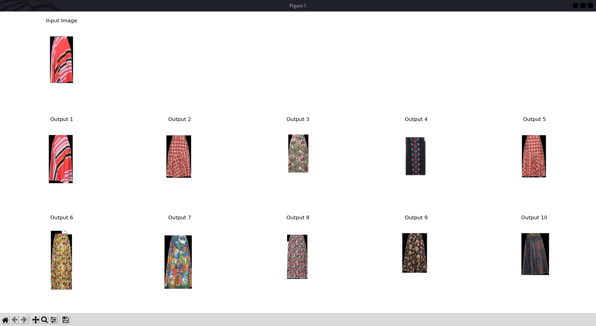

# SimilarSearch

**SimilarSearch** is a Python-based tool for finding visually similar images in a dataset using deep learning and efficient similarity search techniques. It leverages a pre-trained ResNet50 model to extract image features and FAISS (Facebook AI Similarity Search) for fast indexing and retrieval of similar images. This project is designed for applications like image retrieval, duplicate detection, or content-based image recommendation systems, offering a scalable and easy-to-use solution.

## Table of Contents
- [Overview](#overview)
- [Features](#features)
- [Testing Environment](#testing-environment)
- [Prerequisites](#prerequisites)
- [Installation](#installation)
- [Dataset Preparation](#dataset-preparation)
- [Usage](#usage)
- [Results](#results)
- [File Structure](#file-structure)
- [Performance Optimization](#performance-optimization)
- [Contributing](#contributing)
- [License](#license)
- [Acknowledgments](#acknowledgments)

## Overview
**SimilarSearch** enables users to perform efficient similarity searches on image datasets. It extracts deep features from images using a pre-trained ResNet50 model and indexes them with FAISS for fast nearest neighbor search. Given a query image, the tool retrieves the top-k most similar images based on similarity metrics like cosine similarity or Euclidean distance. This project is ideal for researchers, developers, and hobbyists working on computer vision tasks requiring image similarity search.

## Features
- **Efficient Similarity Search**: Utilizes FAISS for fast and scalable nearest neighbor search.
- **Deep Feature Extraction**: Employs a pre-trained ResNet50 model for robust image feature extraction.
- **Multiple Similarity Metrics**: Supports cosine similarity and Euclidean distance for flexible comparison.
- **Scalable for Large Datasets**: Handles large image collections with optimized FAISS indexing.
- **Easy Integration**: Modular scripts for seamless integration into computer vision pipelines.
- **Visualization**: Generates visual outputs showing query images and their most similar matches.

## Testing Environment
The project has been tested in the following environment:
- **OS**: Linux
- **Python**: 3.10
- **CPU**: Intel i5 8th Gen
- **GPU**: None (CPU-based processing)

## Prerequisites
To use this project, ensure you have the following installed:
- Python >= 3.10
- PyTorch >= 1.8 (CPU version, as no GPU is required per testing environment)
- FAISS (CPU version)
- Dependencies listed in `requirements.txt` (e.g., `numpy`, `torchvision`, `Pillow`, `matplotlib`).
- A dataset of images in supported formats (e.g., `.jpg`, `.png`).

## Installation
1. **Clone the Repository**:
   ```sh
   git clone https://github.com/Udit0495/SimilarSearch.git
   cd SimilarSearch
   ```

2. **Set Up a Virtual Environment** (optional but recommended):
   ```sh
   python -m venv venv
   source venv/bin/activate  # On Windows: venv\Scripts\activate
   ```

3. **Install Dependencies**:
   ```sh
   pip install -r requirements.txt
   ```

4. **Install PyTorch (CPU)**:
   Install the CPU version of PyTorch:
   ```sh
   pip install torch torchvision --index-url https://download.pytorch.org/whl/cpu
   ```

5. **Install FAISS (CPU)**:
   ```sh
   pip install faiss-cpu
   ```

## Dataset Preparation
Prepare your image dataset for indexing and similarity search:
1. **Directory Structure**:
   ```
   dataset/
   ├── image1.jpg
   ├── image2.jpg
   ├── image3.png
   └── ...
   ```
   - Place all images in a single directory (e.g., `dataset/`).
   - Supported formats include `.jpg`, `.png`, and other common image types.

2. **Query Image**:
   - Prepare a query image (e.g., `query.jpg`) to search for similar images in the dataset.

3. **Update Configuration**:
   - Modify `main.py` to specify:
     - Path to the dataset directory (`--dataset_dir`).
     - Number of similar images to retrieve (e.g., `k=5`).
     - Similarity metric (e.g., `cosine` or `l2`, if applicable).

## Usage
1. **Index and Search**:
   Run the main script to index the dataset and perform a similarity search:
   ```sh
   python3 main.py --dataset_dir "path/to/dataset"
   ```
   - Replace `path/to/dataset` with the path to your image dataset directory.
   - After running, enter the name of the query image (e.g., `query.jpg`) when prompted:
     

2. **Output**:
   - The script outputs the top similar images with their paths and similarity scores.
   - Visualizations of the query image and its matches are saved in the `results/` directory.

## Results
The following images demonstrate the output of the similarity search:
- **Query Image Input**:
  

- **Sample Outputs** (Top similar images):
  
  
  
  
  

These images showcase the query image and the top similar images retrieved by the system, as generated by `main.py`.

## File Structure
```
SimilarSearch/
├── main.py                     # Main script for indexing and similarity search
├── requirements.txt            # Python dependencies
├── dataset/                    # Directory for input images
├── results/                    # Directory for output visualizations
│   ├── 1.png                   # Query image input example
│   ├── 2.png                   # Similarity search output
│   ├── 3.png                   # Similarity search output
│   ├── 4.png                   # Similarity search output
│   ├── 5.png                   # Similarity search output
│   ├── 6.png                   # Similarity search output
└── README.md                   # Project documentation
```

## Performance Optimization
- **Batch Processing**: Process images in batches during indexing to reduce memory usage.
- **Index Type**: Use FAISS `IndexFlatL2` for small datasets or `IndexIVFFlat` for larger datasets to balance speed and accuracy.
- **Feature Extraction**: Optimize ResNet50 inference by pre-processing images in parallel (modify `main.py` if needed).
- **CPU Optimization**: Since the testing environment uses CPU, ensure multi-threading is enabled for FAISS and PyTorch.

## Contributing
Contributions are welcome! To contribute:
1. Fork the repository.
2. Create a new branch (`git checkout -b feature-branch`).
3. Make your changes and commit (`git commit -m "Add feature"`).
4. Push to the branch (`git push origin feature-branch`).
5. Create a pull request.

Please ensure your code follows the project's coding standards and includes appropriate documentation.

## License
This project is licensed under the MIT License. See the [LICENSE](LICENSE) file for details.

## Acknowledgments
- Built with [PyTorch](https://pytorch.org/) for deep learning and [FAISS](https://github.com/facebookresearch/faiss) for similarity search.
- Inspired by image retrieval systems and open-source computer vision projects.
- Thanks to the open-source community for providing robust tools and pre-trained models.
